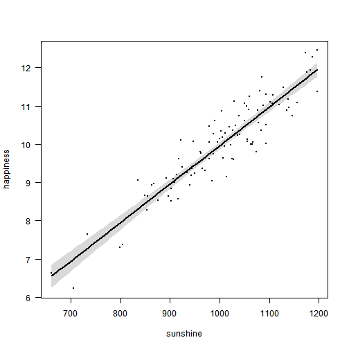
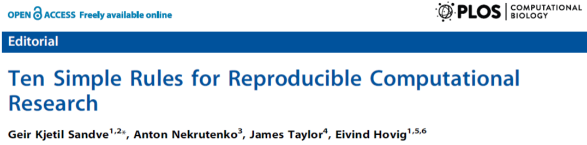

## Typical workflow of many research projects

 
 
First have an idea

e.g. Does sunshine influence happiness?

 
 

---

## 1. Prepare data (Excel)

---

## 2. Do some analysis (R)

---

## 3. Write a report/paper (Word)

All results (figures, tables) **manually** imported to Word

---

## This workflow is broken

 

1. Collect and manage data (**EXCEL**)

2. Analysis (**R**)

3. Write up (**WORD**)

--- &twocol w1:40% w2:60%   

## Problems brought by the broken workflow

*** =left

*** =right

> - What analysis is behind this figure? Did you account for [...] in the analysis?

> - What dataset was used (e.g. final vs preliminary dataset)?

> - Oops, there is an error in the data. Can you repeat the analysis? And update figures/tables in Word!

> - As a coauthor/reader, I'd like to see the whole research process (how you arrived to that conclusion), rather than cooked manuscript with inserted tables/figures.

---

## Rmarkdown allows us to fix the disconnect

Integrating 

1. Data management

2. Data analysis

3. Writing up results

in a single dynamic document

 
 

> **REPRODUCIBLE RESEARCH!**

---

## Let's make our sunshine-happiness research reproducible

 

- Before starting any project read this: 
[Designing projects at Nice R Code](http://nicercode.github.io/blog/2013-04-05-projects/)

 
- Now see [myproject.Rmd](https://github.com/Pakillo/Rmarkdown_tutorial/blob/gh-pages/myproject.Rmd)

--- &twocol

## With PANDOC, conversion to PDF or Word is straightforward

*** =left

*** =right

---

### If spotting error in the data, or using different dataset...

make changes in Rmarkdown and report will update automatically

--- &twocol  

## So... main advantages

*** =left

*** =right

- Data management fully documented (no more manual changes in Excel!)

- Analysis fully documented

- Automated reports

- Lots of customisation options!

---

## Convert your R scripts to Rmd, html, word, pdf...

- with [one click in RStudio](http://www.rstudio.com/ide/docs/authoring/markdown_notebooks)

- using knitr::spin or knitr::stitch [e.g. stitch("Rscript2convert.R")]

---

## Some useful links:

- [Rstudio docs](http://www.rstudio.com/ide/docs/authoring/using_markdown)

- [Course on Reproducible Research by K. Broman](http://kbroman.github.io/Tools4RR/)

- [Reproducible Research in Coursera](https://www.coursera.org/course/repdata)

- [Nice R code](http://nicercode.github.io/guides/reports/)

- [Reproducible Research with R and RStudio](http://christophergandrud.github.io/RepResR-RStudio/)

- [Example of full paper written in Rmd](https://github.com/SimonGoring/GoringetalPollenRichness)

--- 

## More links (software/R packages)

- [CRAN Task View on Reproducible Research](http://cran.r-project.org/web/views/ReproducibleResearch.html)

- [knitr](http://yihui.name/knitr/)

- [pandoc](http://johnmacfarlane.net/pandoc/)

- [pander](http://rapporter.github.io/pander/)

- [rapport](http://rapport-package.info/)

- [reports](http://cran.r-project.org/web/packages/reports/index.html)

---

## Next step: version control of Rmarkdown documents

 

---

## Collaborative writing and version control without learning Git

- [Draftin](https://draftin.com/)

- [SciGit](http://www.scigit.com/)

- [Authorea](https://www.authorea.com/)

---

## To read more

---

## Ten simple rules for Reproducible Research

> 1. For every result, keep track of how it was produced

> 2. Avoid manual data manipulation steps

> 3. Archive the exact versions of all external programs used

> 4. Version control all custom scripts

> 5. Record all intermediate results, when possible in standardized formats

---

## Ten simple rules for Reproducible Research

> 6. For analyses that include randomness, note underlying random seeds

> 7. Always store raw data behind plots

> 8. Generate hierarchical analysis output, allowing layers of increasing detail to be inspected

> 9.  Connect textual statements to underlying results

> 10. Provide public access to scripts, runs, and results

---

## Find these slides at

- [GitHub](http://pakillo.github.io/Rmarkdown_tutorial)

- [Figshare](http://figshare.com/authors/Francisco_Rodriguez_Sanchez/454299)

- [Code](https://github.com/Pakillo/Rmarkdown_tutorial)

---

## END

