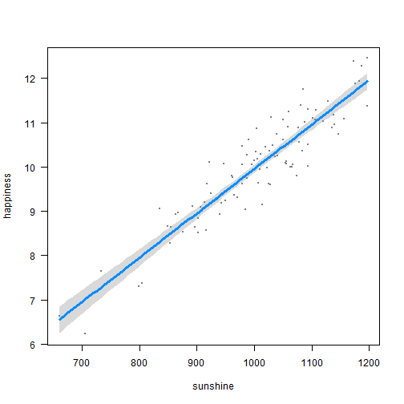

Does sunshine make people happy?
========================================================

Introduction
------------

It is well known that...

Methods
-------

We collected data on 100 individuals and fitted a linear model.

Results
-------

We found that...

id               Estimate    Std. Error    t value    Pr(>|t|)
-------------  ----------  ------------  ---------  ----------
(Intercept)       -0.0652        0.4265    -0.1528      0.8789
sunshine           0.0100        0.0004    23.6833      0.0000

 

Discussion
----------

So these results confirm that sunshine is good for happiness (slope = 0.01).

